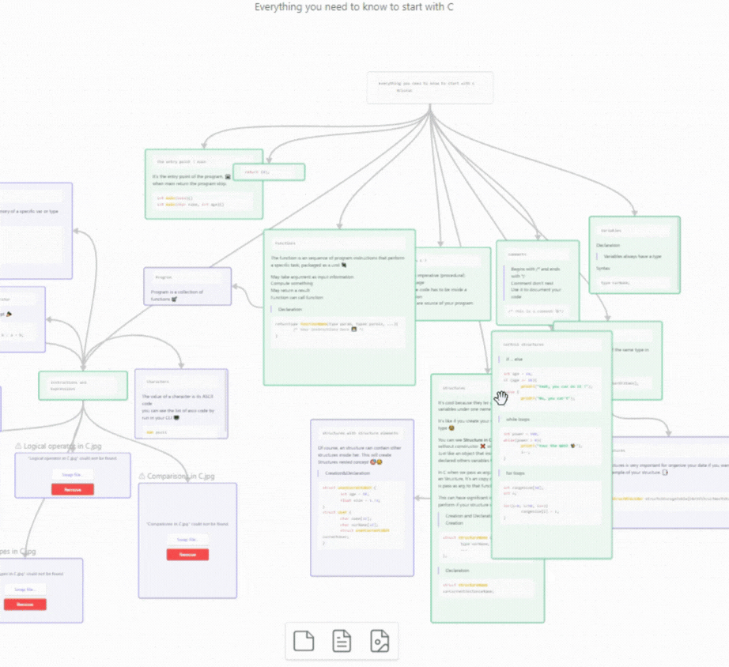

# Obsidian Canvas Node Screenshot

A plugin for [Obsidian](https://obsidian.md) that allows you to take screenshots of nodes in the canvas.

## Features

- Take screenshots of nodes in the canvas.
- Easy-to-use plugin.

## Usage

1. Click on the screenshot icon in the canvas menu.
2. Save or specify the location to store the captured screenshot.
3. Click "Save" to store the screenshot.

## Installation

- Not ready for market yet.
- Can be installed via the [Brat](https://github.com/TfTHacker/obsidian42-brat) plugin.
- Manual installation:

    1. Find the release page on this GitHub page and click.
    2. Download the latest release zip file.
    3. Unzip it, copy the unzipped folder to the Obsidian plugin folder (ensure it contains `main.js` and `manifest.json`).
    4. Restart Obsidian (or refresh the plugin list) and enable the plugin in the settings interface.

## Support

If you find this plugin helpful and want to support my work, you can just **Star ⭐** this repository.
